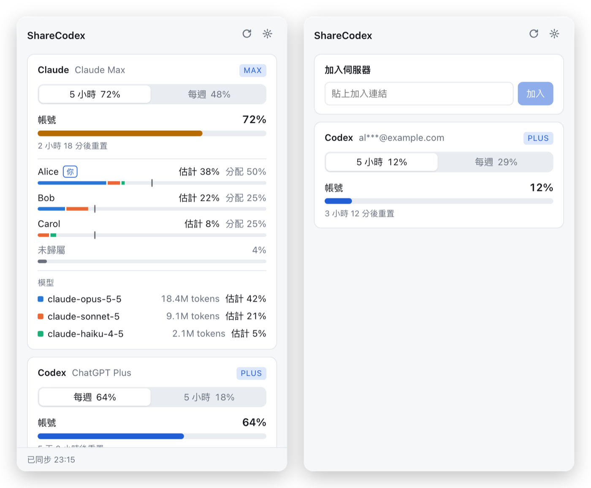
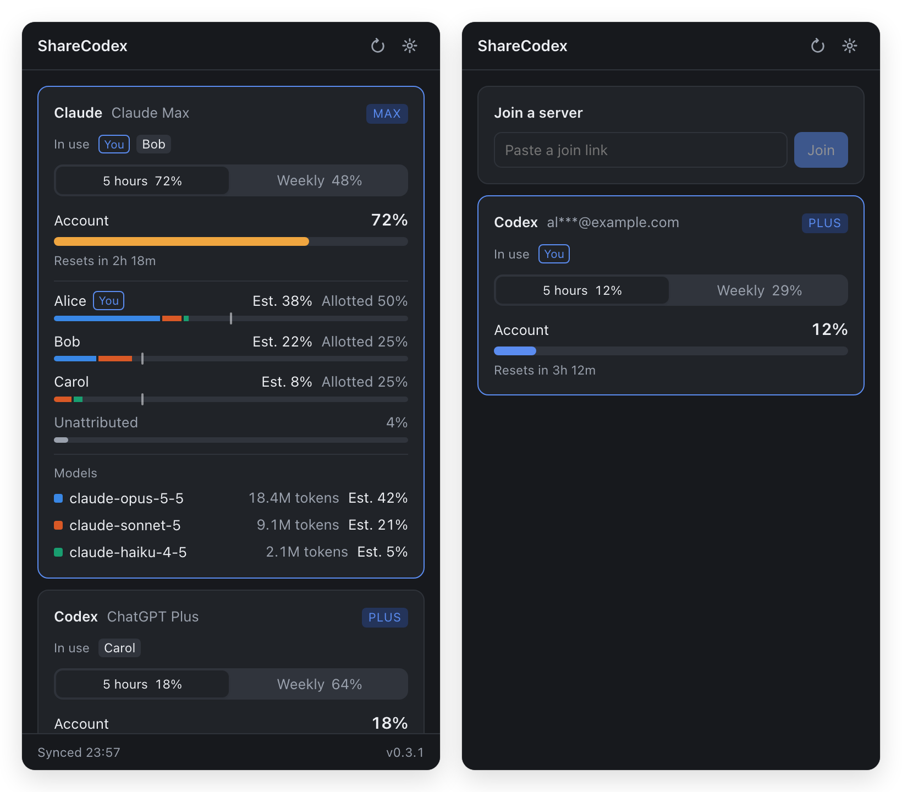
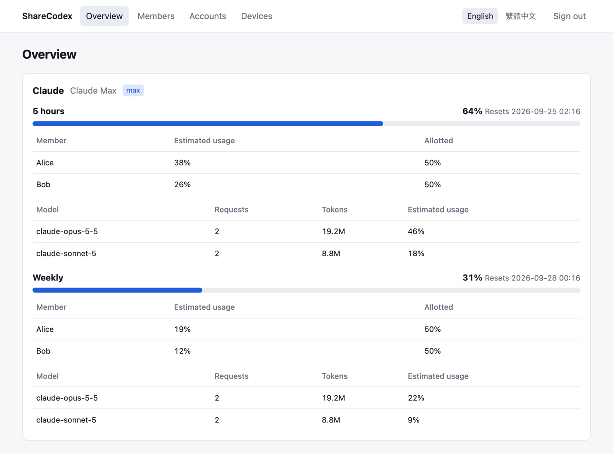
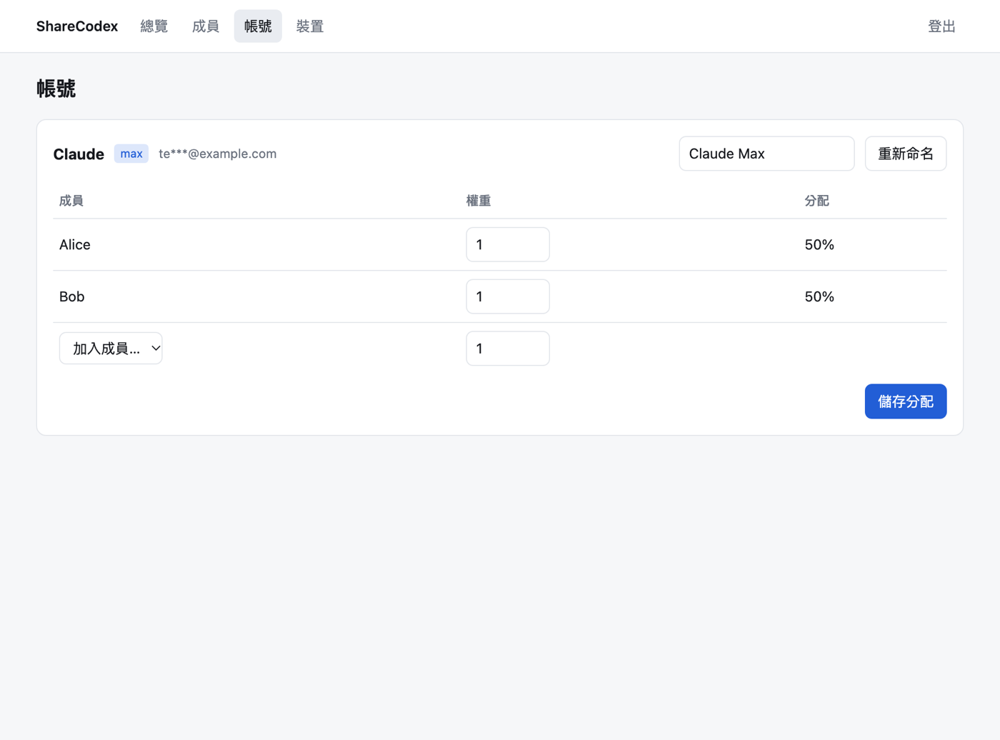

<p align="center">
  
</p>

<h1 align="center">ShareCodex</h1>

<p align="center">
  <strong>One subscription, many coders, no guesswork.</strong><br>
  See how much of each shared Claude and ChatGPT plan is left — and who used it.
</p>

<p align="center">
  English | <a href="README.zh-TW.md">繁體中文</a>
</p>

<p align="center">
  <a href="https://github.com/KoukeNeko/ShareCodex/releases/latest"></a>
  <a href="https://github.com/KoukeNeko/ShareCodex/releases"></a>
  
  <a href="https://github.com/KoukeNeko/ShareCodex/pkgs/container/sharecodex-server"></a>
  <a href="https://github.com/KoukeNeko/ShareCodex/stargazers"></a>
</p>

<p align="center">
  <a href="https://github.com/KoukeNeko/ShareCodex/releases/latest">Download</a>
  · <a href="#getting-started">Getting started</a>
  · <a href="#run-the-server">Run the server</a>
</p>

When a few people share Claude Max/Pro and ChatGPT Plus subscriptions, the provider tells you only
one thing: how much of the whole account is gone. ShareCodex adds the rest — **how much of each
5-hour and weekly window is left, how much each person is allotted, roughly how much each has
used, and which models used it.**

Each member runs a small menu bar (macOS) or system tray (Windows) app. It reads the Claude Code and
Codex logs already on the computer, asks the official CLIs which account is signed in, and syncs
token counts to a server you host yourself.

Only coding-agent usage counts: Claude Code, and the Codex CLI, desktop app and IDE extension.
ChatGPT web chat is not tracked.

## See it in action

<p align="center">
  
  
</p>

<p align="center">
  
  
</p>

## What it shows

### Every shared account at a glance

The popup lists each shared account with its 5-hour and weekly windows, how much of each is used,
and when it resets. The numbers come straight from Claude Code and Codex.

### Who used what

Each member has a bar for their estimated usage and a tick mark at their allotment. Anyone past their
share is marked **over allotment**. Quota used with no matching record from anyone is shown as
**unattributed** instead of being pinned on someone.

### Which models used it

Each window also breaks usage down by model — requests, tokens, and an estimated share — so you can
tell whether the week went to Opus or to a long run of Sonnet.

### Joining takes one link

An admin creates a single-use join link in the web console. The member pastes it into the app, signs
in to the shared account in Claude Code or Codex as usual, and is added to that account
automatically.

### Runs quietly in the background

The app keeps working when the server is unreachable and uploads when it's back. It can start at
login, refreshes when you open it, and never opens a terminal window.

### Admin in the browser

Members, join links, account names, allotment weights and devices are all managed at `/admin/` on
your server. No shell access to the container is needed.

## Privacy by design

- Only token counts, model names, timestamps and quota percentages leave the computer.
- Prompts, responses, working directories and project paths are never read into the ledger or
  uploaded.
- Accounts are identified by a one-way hash; the server keeps only a masked email such as
  `al***@example.com` so admins can tell accounts apart.
- No credential files are read. Account identity comes from `claude auth status` and Codex's own
  app server.
- The server is yours. There is no third-party service, analytics or tracking.

## Getting started

1. **Get a join link** from whoever runs your ShareCodex server.
2. **Install the app** (see [Get the app](#get-the-app)) and open it from the menu bar or system
   tray.
3. **Paste the join link.** Each of your computers needs its own link.
4. **Sign in to the shared account** in Claude Code or Codex as usual. The account appears once the
   app sees it.
5. **Turn on statusLine capture** in the app's settings to get Claude's quota. Your existing
   statusLine keeps working, and turning it off restores your original setting.

Usage from before you joined is not uploaded.

## Run the server

Requires Docker. The server does not terminate TLS; put it behind a reverse proxy such as Caddy,
nginx or a Cloudflare Tunnel.

Download `sharecodex-server-compose.zip` from the
[latest release](https://github.com/KoukeNeko/ShareCodex/releases/latest). It runs the published image
`ghcr.io/koukeneko/sharecodex-server` (linux/amd64 and linux/arm64), pinned to that release.

```bash
unzip sharecodex-server-compose.zip && cd sharecodex-server-compose
cp .env.example .env    # set POSTGRES_PASSWORD, PUBLIC_URL and ADMIN_PASSWORD
docker compose up -d
```

`PUBLIC_URL` is the address members reach the server at; it appears in join links. To upgrade, set
`SHARECODEX_VERSION` in `.env` to the new release (or use a newer bundle) and run
`docker compose up -d` again.

Then open `PUBLIC_URL/admin/` and sign in with `ADMIN_PASSWORD`:

| Page | What you do there |
|---|---|
| Overview | Every account's windows, each member's allotment and estimated usage, and usage by model |
| Members | Add members and create single-use join links |
| Accounts | Rename accounts and set each member's allotment weight |
| Devices | See each device's last sync and revoke devices |

Admin sessions are kept in memory, so restarting the server signs the admin out.

## Compatibility

- **Desktop:** macOS (Apple silicon and Intel) and Windows (x64 and ARM64)
- **Agents:** Claude Code with a Claude Pro/Max subscription; Codex CLI, desktop app and IDE extension
  with a ChatGPT subscription
- **Server:** any Docker host, linux/amd64 or linux/arm64
- **Interface:** Traditional Chinese

Usage routed to other vendors' models — Claude Code through a gateway, or Codex with a third-party
model provider — is ignored, because it doesn't draw on the shared subscription.

## Get the app

macOS, with [Homebrew](https://brew.sh):

```bash
brew install --cask koukeneko/tap/sharecodex
```

Windows, with [Scoop](https://scoop.sh):

```powershell
scoop bucket add koukeneko https://github.com/KoukeNeko/scoop-bucket
scoop install koukeneko/sharecodex
```

Or download `ShareCodex-macos-universal.zip`, `ShareCodex-windows-amd64.zip` or
`ShareCodex-windows-arm64.zip` from the
[latest GitHub Release](https://github.com/KoukeNeko/ShareCodex/releases/latest). The macOS app is
signed with a Developer ID and notarized by Apple. The app checks GitHub for new releases and tells
you when one is out; it never installs anything by itself. Update with `brew upgrade --cask
sharecodex` or `scoop update sharecodex`.

---

## Technical reference

### How usage is measured

- **Claude Code** — `~/.claude/projects/**/*.jsonl` transcripts. Each response is counted once by
  message ID and request ID, keeping the largest output count (earlier lines carry partial counts
  while streaming). Resumed sessions that copy earlier requests into a new file are counted once.
- **Codex** — `~/.codex/sessions` and `archived_sessions` rollouts. Per-request records are used when
  present; older files fall back to the difference between cumulative totals.
- **Quota** — Codex reports its windows in the rollouts and through `codex app-server`; Claude's come
  from the statusLine input, which the app captures through a small shim.
- **Account** — each event is matched to the account the device was signed into at that moment.

### How shares are estimated

Each member's allotment is `weight ÷ sum of all members' weights` on that account. All weights
default to 1; a weight of 0 removes a member from the allotment but keeps their usage.

Providers report only the percentage used for the whole account. Each person's — and each model's —
part is estimated from their share of API-equivalent cost within the same window, so it is always
labelled as an estimate. The prices in `internal/attribution/pricing.json` set only the relative
weight between models; they are not a bill.

### Development

Requires Go 1.27, Node 24, pnpm, and the Wails CLI
(`go install github.com/wailsapp/wails/v3/cmd/wails3@v3.0.0-beta.25`).

```bash
go test ./...                     # server integration tests also need TEST_DATABASE_URL
wails3 task dev                   # run the desktop app in development mode
wails3 task package VERSION=0.1.0 # package the app (bin/ShareCodex.app on macOS)
go run . scan                     # print local daily token totals without writing to the database
```

Set `SHARECODEX_HOME` to use another data directory, for example to simulate several devices on one
computer. To build the server from a checkout, run
`docker compose -f docker-compose.yml -f docker-compose.build.yml up -d --build` in `deploy/`.

Dependencies point inward only:

```
domain  ←  provider adapters  ←  client / server  ←  Wails / HTTP / SQL / OS
```

`internal/account`, `identity`, `usage`, `quota` and `attribution` must not depend on storage,
networking, the desktop framework or provider code; `internal/architecture_test.go` enforces this.
Design notes and verification records are in [docs/plan.md](docs/plan.md) and
[docs/spikes.md](docs/spikes.md) (Traditional Chinese).

### Releases

Pushing a `v*` tag runs `.github/workflows/release.yml`. It builds a universal macOS `.app`,
Windows `.exe` files for x64 and ARM64, Linux server binaries and the Docker Compose bundle, pushes the server image to
`ghcr.io/koukeneko/sharecodex-server`, and creates a GitHub Release with `SHA256SUMS`. It then runs
`.github/workflows/packages.yml`, which updates the cask in
[KoukeNeko/homebrew-tap](https://github.com/KoukeNeko/homebrew-tap) and the manifest in
[KoukeNeko/scoop-bucket](https://github.com/KoukeNeko/scoop-bucket); run it by hand to backfill a
release.

Code signing runs only when its repository secrets are set. Without them, the macOS app is only
ad-hoc signed and users must allow it the first time in System Settings › Privacy & Security.

| Secret | Purpose |
|---|---|
| `MACOS_CERTIFICATE_P12_BASE64` (base64 of a `.p12` containing a Developer ID Application certificate and its key), `MACOS_CERT_PASSWORD` | Developer ID signing |
| `ASC_KEY_P8_BASE64` (base64 App Store Connect API key `.p8`), `APPLE_API_KEY_ID`, `APPLE_API_ISSUER_ID` | Notarization |
| `WINDOWS_CERT_PFX` (base64), `WINDOWS_CERT_PASSWORD` | Windows code signing |
| `HOMEBREW_TAP_TOKEN`, `SCOOP_BUCKET_TOKEN` (fine-grained tokens with Contents read/write on the tap and the bucket) | Publishing packages; required |

<p>
  <a href="https://github.com/KoukeNeko/ShareCodex/actions/workflows/ci.yml"></a>
  
  
  
  
</p>

## Support

If ShareCodex is useful to you, you can support development:

<a href="https://buymeacoffee.com/doershing"></a>
